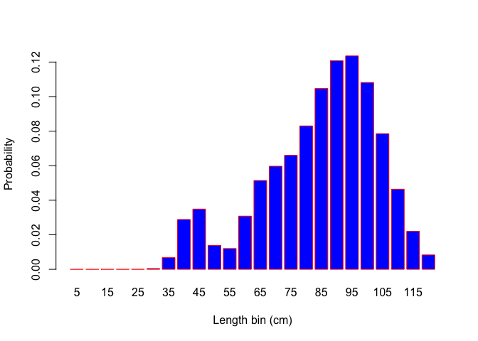
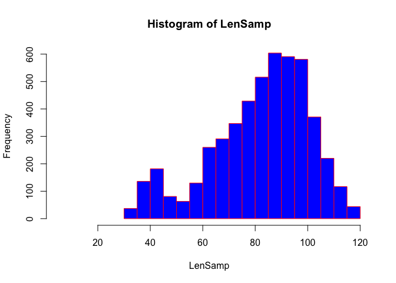

Psuedocode Assignment 2 - Taylor et al’s (2005) method for estimating
growth parameters in fish populations
================
Christian Carson
02/13/2024

# Metadata

This code calculates the probability of capturing (sampling) fish at
different lengths.

Inputs: von Bertalanffy growth model parameters and Taylor et al. (2005)
selectivity parameters (outlined below)

Outputs:

- A bar plot that showss the probability of capturing a fish at length
  $x$

- A histogram showing a simulated distribution of the length of fish
  captured (5000) based on the calculated probabilities from the
  afformentioned the bar plot

# Background:

The von Bertalanffy growth model is a often used used to describe the
growth of fish:

$$L(a) = L_{\infty} (1 - e^{-K(a - t_0)})$$

Where,

- $(a)$ is the age of the fish

- $L(a)$ is the length of the fish at age $a$

- $L_{\infty}$ is the mean maximum equalibrium length or the asymptotic
  length

- $K$ is the growth coefficient, describing the metabolic rate of the
  fish

- $t_0$ is the age at which the fish is of zero length or the x
  intercept of the growth curve so that fish are born at age $t_0$

Together, these parameters describe the growth (length) of the fish over
time (age).

The growth parameters in the von Bertalanffy model can be estimated
using length-at-age data. However, Taylor et al. (2005) found that this
data is often biased because fishing gears tend to disprortionately
capture larger fish, thus underestimating the growth parameters. To
account for this bias, Taylor et al. (2005) proposed a method that
adjusts for size selection bias in fishing gear.

Taylor et al. 2005’s highlighted three probabiltiy processes that need
to be accounted for in his method:

1.  The probability of selecting an age $a$ fish in the population;
    $P_a$

Which is accounted for by estimating the annual survival rate for fish,
$S$, raied to the power of the age of the fish minus 1:

$$P_a = S^{(a-1)}$$

Where,

- $S$ is the survival rate for fish (annual)

2.  The probability of an age $a$ fish being length $x$; $L(a)$

Which is accouted for by the von Bertalanffy growth model, which shows
the allometric relationship of the length of fish to thier age (see
above)

3.  The probability of capturing a fish of length $x$; $S(x)$

Which is accounted for by the selectivity logistic function (Taylor et
al. 2005)

$$s(x) = \frac{1}{1 + e^{-(x - \mu)/\sigma}}$$

Where,

- $\mu$ is the length of fish at 50% probability of being captured

- $\sigma$ is the standard deviation in selectivity

These three probabilities are combined to calculate the probability of
capturing a fish of length $x$ at age $a$:

# Parameters defined

The following parameters are defined here and given inputs for the
functions below:

- Linf: The mean maximum equilibrium length or asymptotic length - von
  Bertalanffy growth model

- K: The growth rate or metabolic rate - von Bertalanffy growth model

- t0: The age at which the fish is of zero length or the x intercept of
  the growth curve - von Bertalanffy growth model

- CV: The variation in length at a given age - von Bertalanffy growth
  model

- S: The annual survival rate for fish - Probability of capture at age
  $a$ fish in the population

- mu: The length of fish at 50% probability of being captured -
  selectivity logistic function

- sig: The standard deviation in selectivity - selectivity logistic
  function

- Age: The total range of ages for fish - von Bertalanffy growth model

- x: The total range of lengths for fish - selectivity logistic function

``` r
Linf  <- 100

K     <- 0.5

t0    <- -0.1

S     <- 0.8

mu    <- 55

sig   <- 15

CV    <- 0.1

Age   <- 1:20

x     <- seq( from=5, to=120, by=5 )
```

# Setup functions

The following four code blocks setup the probability functions used
together to calculate the probability of capturing a fish of length $x$
at age $a$:

The first code block calculates the length of fish at each age (von
Bertalanffy growth model):

``` r
La    <- Linf * ( 1-exp( -K*( Age-t0 )))
```

The second code block calculates the standard deviation in lengths at
age (La \* CV (variation in lengths at age)):

``` r
sig_a <- La*CV
```

The third code block calculates the probability of selecting an age $a$
fish in the population (Taylor et al. (2005)):

``` r
Pa    <- S^( Age-1 )/sum( S^( Age-1 ))
```

and finally the fourth block, calculates the probability of capturing a
fish of length $x$ (logistic size selectivity function - Taylor et
al. (2005)):

``` r
sx    <- 1 / ( 1 + exp( -( x-mu )/sig ))
```

# Calculating the probability of a fish being length $x$ at age $a$

First we create an empty matrix to store the probability of a fish being
length $x$ at age $a$:

``` r
P_x_a <- matrix( nrow=length(x), ncol=length(Age) )
```

Then we make an empty vector to store the probability of capturing a
fish of length $x$:

``` r
Z     <- vector( length=length(x) )
```

With the empty matrix and vector created, we make a for loop (each step
is explained in the comments):

``` r
#The loop iterates over each length bin in the x vector
for( i in 1:length(x) ){
  #Calculates the the probability of a fish being in the specific length bin around x[i] at age (a), based on a normal distribution (pnorm), where +/- 2.5 is bounds of the length bin, and La and sig_a are the mean and standard deviation of the length at age
  #These probabilities are stored in the matrix P_x_a, where each each age has a probability of being in each length bin
  P_x_a[i,] <- pnorm( x[i]+2.5, mean=La, sd=sig_a ) - 
    pnorm( x[i]-2.5, mean=La, sd=sig_a )

  Z[i] <- sum( 
    #multiplies the probabilty of a fish (i) being a certain age by the probability of capture at a certain length
    Pa * sx[i] 
  #then multiplies the previous product (Pa * sx[i]) by the probabilty of a that fish, at that age, being in a certain length bin (P_x_a[i)
  * P_x_a[i,] )
  #the sum function then adds the probabilities of all ages together to get the total probability of capturing a fish of length x[i]
}
#the sum is then stored in the Z vector
#the Z vector is then normalized so that the sum of all probabilities equals 1
Z     <- Z / sum( Z )
```

# Plotting the results

Finally, we plot the results of the Z vector, which is the probability
of capturing a fish of length $x$:

``` r
barplot( height=Z, names=x, col="blue", border="red",
         xlab="Length bin (cm)", ylab="Probability")
```

<!-- -->
Each bar represents a length bin and its height corresponds to the
probability of capturing a that length of fish. This bar plot show the
disproportional probability of capturing larger fish.

Now, we create a sampling distribution of the length of fish captured
(5000) based on the calculated probabilities in the bar plot:

``` r
LenSamp <- sample(x=x, size=5000, replace=TRUE, prob=Z ) 

hist( LenSamp, xlim=range(x), col="blue", border="red" )
```

<!-- -->
The historgram show how many fish fall into each length bin of captured
fish, further showing the selection bias Taylor et al. (2005) pointed
out by converting the probabilities into actualized catch and thier
associated lengths.
