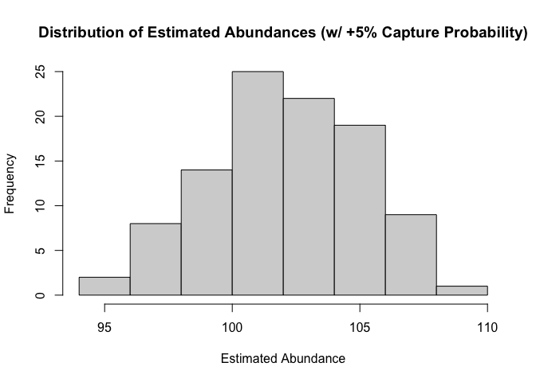
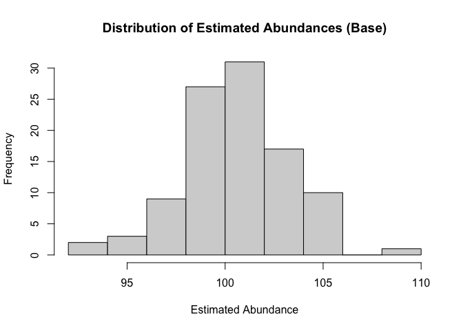
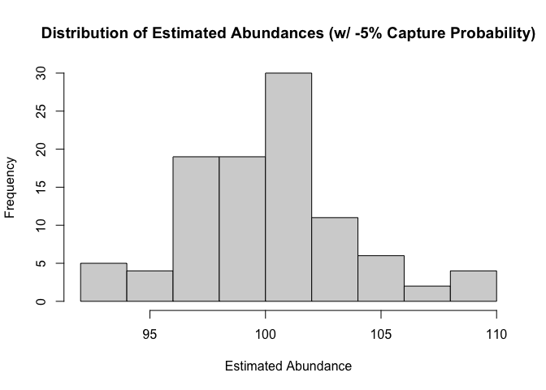
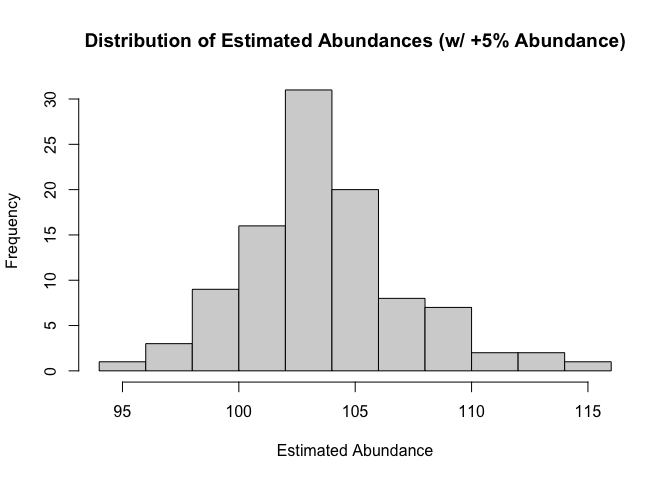
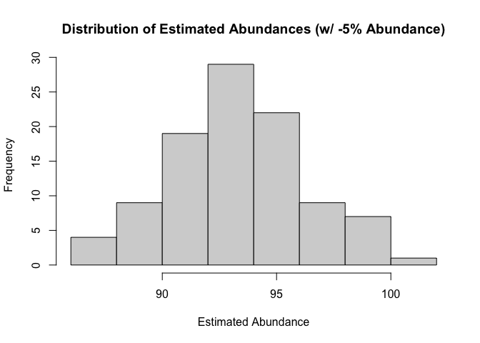

Assignment 3 - Depletion assumptions
================
Christian Carson
02/26/2024

Leslie Depletion Model Base $$ N_t = N_0 - K_t $$

Where: - $N_t$ is the number of fish at time $t$ - $N_0$ is the initial
number of fish - $K_t$ is the cumulative catch up to the last time
period

K_t is calculated as: $$ K_t = \sum_{t=0}^{t-1} C_t $$

So, in period 1, $K_1 = C_0$, in period 2, $K_2 = C_0 + C_1$, and so on.

If we assume catch rate is proportional to abundance
(i.e. $C_t/E_t = qN_t$), then we can substitute this into the Leslie
Depletion Model to get: $$ C_t/E_t = qN_0 - qK_t $$

Where: - $q$ is the catchability constant, the proportion of the
population caught per unit of fishing effort. If effor is constant,
E_t\` is constant, and $C_t/E_t$ is the catch rate, then $q$ is the
catch rate per unit of effort.

So, if we assume that the catch rate is proportional to abundance, then
the Leslie Depletion Model becomes: C_t = pN_0 - pK_t

Where: - $p$ = is the probability of capture

The main assumptions of the Leslie Depletion Model are: 1. equal capture
probability between successive depletion events; 2. all animals are
equally catchable; 3. the population is closed.

This markdown explores where or not these assumptions ‘hold water’, pun
intended.

First, we adapt the code from class of the threepass code from class to
evaluate how changes in capture probability and abundance affect the
estimated abundance at time 0.

    ```r
    "Base" <- function(N_0 = 100, p = 0.5) {
    C_t <- vector()
    N_t <- vector()
    K_t <- vector()
    K_t[1] <- 0
    N_t[1] <- N_0
    for(t in 1:5){
        C_t[t] <- rbinom(n = 1, size = N_t[t], prob = p)
        K_t[t+1] <- K_t[t] + C_t[t]
        N_t[t+1] <- N_t[t] - C_t[t]
    }
    lin_est <- lm(C_t~K_t[1:5])
    N_0_hat <- lin_est$coef[1]/-lin_est$coef[2]
    return(N_0_hat)
    }
    ```

Then, we modify the capture probability and abundance in several
different ways: (1) proportional change in capture probability of +5%
per time step

``` r
"P_Pos" <- function(N_0 = 100, p = 0.5, delta_p = 0.05) {
  C_t <- vector()
  N_t <- vector()
  K_t <- vector()
  K_t[1] <- 0
  N_t[1] <- N_0
  for(t in 1:5){
      C_t[t] <- rbinom(n = 1, size = N_t[t], prob = p)
      K_t[t+1] <- K_t[t] + C_t[t]
      N_t[t+1] <- N_t[t] - C_t[t]
      p <- p * (1 + delta_p)  
  }
  lin_est <- lm(C_t~K_t[1:5])
  N_0_hat <- lin_est$coef[1]/-lin_est$coef[2]
  return(N_0_hat)
}
```

2)  proportional change in capture probability of -5% per time step

``` r
"P_Neg" <- function(N_0 = 100, p = 0.5, delta_p = -0.05) {
    C_t <- vector()
    N_t <- vector()
    K_t <- vector()
    K_t[1] <- 0
    N_t[1] <- N_0
    for(t in 1:5){
        C_t[t] <- rbinom(n = 1, size = N_t[t], prob = p)
        K_t[t+1] <- K_t[t] + C_t[t]
        N_t[t+1] <- N_t[t] - C_t[t]
    }
    lin_est <- lm(C_t~K_t[1:5])
    N_0_hat <- lin_est$coef[1]/-lin_est$coef[2]
    return(N_0_hat)
    
}
```

3)  proportional change in abundance of +5% per time step

``` r
"A_Pos" <- function(N_0 = 100, p = 0.5, delta_N = 0.05) {
    C_t <- vector()
    N_t <- vector()
    K_t <- vector()
    K_t[1] <- 0
    N_t[1] <- N_0
    for(t in 1:5){
        C_t[t] <- rbinom(n = 1, size = N_t[t], prob = p)
        K_t[t+1] <- K_t[t] + C_t[t]
        N_t[t+1] <- N_t[t] - C_t[t]
        N_t[t+1] <- as.integer(N_t[t+1] * (1 + delta_N)) 
    }
    lin_est <- lm(C_t~K_t[1:5])
    N_0_hat <- lin_est$coef[1]/-lin_est$coef[2]
    return(N_0_hat)
}
```

4)  proportional change in abundance of -5% per time step

``` r
"A_Neg" <- function(N_0 = 100, p = 0.5, delta_N = -0.05) {
    C_t <- vector()
    N_t <- vector()
    K_t <- vector()
    K_t[1] <- 0
    N_t[1] <- N_0
    for(t in 1:5){
        C_t[t] <- rbinom(n = 1, size = N_t[t], prob = p)
        K_t[t+1] <- K_t[t] + C_t[t]
        N_t[t+1] <- N_t[t] - C_t[t]
        N_t[t+1] <- as.integer(N_t[t+1] * (1 + delta_N)) 
    }
    lin_est <- lm(C_t~K_t[1:5])
    N_0_hat <- lin_est$coef[1]/-lin_est$coef[2]
    return(N_0_hat)
}
```

Now, we run each senario 100 times to get a distribution of estimted
abundances

``` r
Base_Results <- replicate(100, Base(N_0 = 100, p = 0.5))
P_Pos_Results <- replicate(100, P_Pos(N_0 = 100, p = 0.5, delta_p = 0.05))
P_Neg_Results <- replicate(100, P_Neg(N_0 = 100, p = 0.5, delta_p = -0.05))
A_Pos_Results <- replicate(100, A_Pos(N_0 = 100, p = 0.5, delta_N = 0.05))
A_Neg_Results <- replicate(100, A_Neg(N_0 = 100, p = 0.5, delta_N = -0.05))
```

Finally, we visualize the results side by side for comparisons to be
made in the questions below.

In the first senario, increasing the probability of capture overtime
seems to result in an overestimation of population abundance. This is
likely because the higher propbability in later captures results in a
larger proprotion of the population being caught, which is then used to
estimate the initial population size.

In the real world, this might be due a myriad of factors, such as the
animals becoming habituauted to the capture methods, capture methods
becoming more efficient over time, animals becoming less cuatios over
time, or the population becoming more concentrated over time where the
capture methods are deployed (where humans are). To curb these influnces
on the estimate of initial abundance, researchers could conduct random
stratified sampling and use a variety of capture methods.

``` r
hist(Base_Results, main = "Distribution of Estimated Abundances (Base)", xlab = "Estimated Abundance")
```

<!-- -->

``` r
hist(P_Pos_Results, main = "Distribution of Estimated Abundances (w/ +5% Capture Probability)", xlab = "Estimated Abundance")
```

<!-- -->

In the second senario, we see a an underestimation of population size.
This is likely because the lower capture probability in later captures
results in a smaller proprotion of the population being caught, in turn
influencing the initial population size and the abundance estimate.

This might happen in the real world due to animals becoming more cautios
and avoiding capture method or changes in the envrionmental conditions
(e.g. temperature, water quality, etc.) resulting in more patchy
distribution. To address these issues, researchers could again conduct
random stratified sampling and use a variety of capture methods.

``` r
hist(Base_Results, main = "Distribution of Estimated Abundances (Base)", xlab = "Estimated Abundance")
```

<!-- -->

``` r
hist(P_Neg_Results, main = "Distribution of Estimated Abundances (w/ -5% Capture Probability)", xlab = "Estimated Abundance")
```

<!-- -->

In the third senario, the increase of population size (+5 abundance)
seems to lead to overestimating the abundance. This is because the model
does not account for new animals entering the population.

In the real world, this might happen through an increase in births,
immigration, or a reduction in deaths or emigration. To address this,
researchers could standardize the time period over which the population
is sampled and adjust the model to account for these population
dynamics.

``` r
hist(Base_Results, main = "Distribution of Estimated Abundances (Base)", xlab = "Estimated Abundance")
```

<!-- -->

``` r
hist(A_Pos_Results, main = "Distribution of Estimated Abundances (w/ +5% Abundance)", xlab = "Estimated Abundance")
```

<!-- -->

In the forth senario, the decrease of population size (-5 abundance)
seems to lead to underestimating abundance. This is because the model
does not account for new animals leaving the population via death or
emigration.

In the real world, this might happen through a decrease in births,
emigration, or an increase in deaths via predation, disease, or other
factors such as habitat degreation or environmental stressors.

Again, to address this, researchers could standardize the time period
over which the population is sampled and adjust the model to account for
these population dynamics.

``` r
hist(Base_Results, main = "Distribution of Estimated Abundances (Base)", xlab = "Estimated Abundance")
```

<!-- -->

``` r
hist(A_Neg_Results, main = "Distribution of Estimated Abundances (w/ -5% Abundance)", xlab = "Estimated Abundance")
```

<!-- -->
