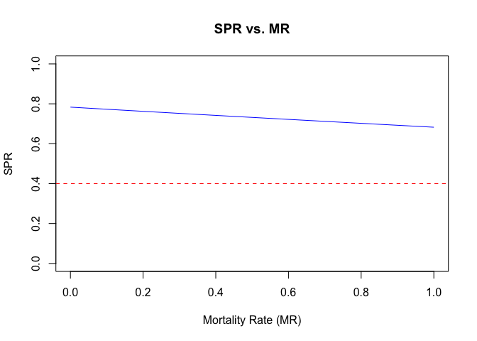
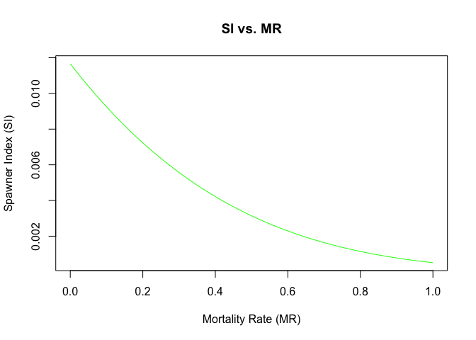

Assignment 5 - Prawns
================
Christian Carson
03/25/2024

# Introduction

This document models the population dynamics of spot prawns using
Beverton-Holt recruitment model. The recruitment model equation is given
by:

$$
N_{t1,t} = \frac{\alpha \cdot S_{pt-1}}{1 + \beta \cdot S_{pt-1}}
$$

where: - $N_{t1,t}$ is the number of new recruits at time $t$,

- $\alpha$ is the maximum recruitment rate,

- $\beta$ is the rate at which recruitment increases with the number of
  spawning prawns,

- $S_{pt-1}$ is the number of spawners at time $t-1$.

``` r
#total number of time steps, 3 months each covering 10 years. So (10*12)/3 = 40
nT <- 40
#create a function that will model the prawn population over time; MR is the mortality rate due to release after being caught, E is the fishing effort in terms of traps deployed
PrawnModel <- function(MR=0, E=400){
#base of the Beverton-holt model, where alpha is the maximum number of prawns that can be caught
alpha <- 1000
#beta is the rate at which the number of prawns caught increases with effort
beta <- 1e-3
#q is the catchability of the prawns
q <- 0.001
# assume 3-month time-steps
#p represents the transition rates between each life stage
p <- c( 1/5, 1/4, 1/3, 1, 1/2 )
#s represents the survival rates of each life stage, the last is 0 because the female prawns die after spawning
S <- c( 0.5, 0.55, 0.6, 0.6, 0.6, 0.0 )
#N0 represents the initial number of prawns in each life stage,the last is 0 because the female prawns die after spawning
N0 <- c( 1000000, 175000, 39000, 10000, 5000, 0 )
#seL represents the selectivity of the prawns at each life stage, or how likely they are to be caught
sel <- c( 0, 0.1, 0.3, 0.7, 1, 0.8 )
#prel represents the probability of a prawn being released after being caught, which modifies the survival rates below
prel <- c( 0, 0, 0, 0, 1, 0 )
#S represents the survival rates of each life stage. S is a product of 1 minus the catchabiliy multiplied by the effort, the selectivity, 1 minues the probability of being released, and plus the probability of mortality due to release
S <- S * (1- q * E * sel * ((1 - prel) + prel*MR ))
#setup the matrices to store the results for each time step
Nt <- matrix(nrow=nT,ncol=6)
Ct <- matrix(nrow=nT,ncol=6)
#initialize the first row of the matrices with the initial values from N0
Nt[1,] <- N0
#calculate the intial catch for the first time step based on the initial number of prawns, the catchability, the effort, and the selectivity
Ct[1,] <- Nt[1,]*q*E*sel
#setup the vectors for the spawner abundance and index, use "numeric" to ensure they dont get converted to logical
Spawn <- vector("numeric",nT)
SI <- vector("numeric",nT)
#initialize the spawning population and SI for the first time step, where spawn is Nt for the 5th stage, multiplied by the survival rate for the 5th stage, and the probability of being caught for the 5th stage
Spawn[1] <- Nt[1,5] * S[5] * p[5]
#initialize the spawner index for the first time step, which is the catch for the 5th stage divided by the effort (constant at 400)
SI[1] <- Ct[1,5] / E
#start the for loop for t in 2 to nT because we have already calculated the first time step, nT will go to 40 for the 3 month time steps
for (t in 2:nT) {
#here we use the Beverton-Holt recruitment model to calculate the number of new recruits at time t, which is the alpha multiplied by the spawning population at time t-1, divided by 1 plus beta multiplied by the spawning population at time t-1
Nt[t,1] <- alpha * Spawn[t-1] / (1 + beta * Spawn[t-1])
#we then use a for loop to calculate the number of prawns in each life stage at time t, applying if/else statements to account for the last stage where the prawns die
for (stage in 2:6) {
#the if statement is used to check if the stage is less than 6 because life ends after that, if it is then we calculate the number of prawns in the stage at time t based on the number of prawns in the previous stage at time t-1, the transition rate, and the survival rate
if (stage < 6) {
Nt[t,stage] <- Nt[t-1,stage-1] * p[stage-1] * S[stage-1] 
#otherwise we set the number of prawns in the stage at time t to 0 because they have died
} else {
Nt[t,stage] <- 0  
}
}
#now that we have calculated the number of prawns in each life stage at time t, we calculate can iterate through the catch matrix to calculate the catch
Ct[t, ] <- Nt[t, ] * q * E * sel 
#here we calc spawner abundance at each time step
Spawn[t] <- Nt[t,5] * S[5]
#finaly we calculate spawner index at each time step
SI[t] <- Ct[t,5] / E 
}

#phi, spawners per immature prawn
#here we divide the spawning population by the number of prawns in the first stage at each time step to get the spawners per immature prawn at each time step
Phi <- Spawn[nT] / Nt[nT,1]
  
#same as in bretts code but we add phi to the output list
out <- list(Spawn = Spawn, SI = SI, Ct = Ct, Nt = Nt, Phi = Phi)
#return the output of the list above
return(out)
}

#this is our base model with no mr or fishing effort, its takes the output of the PrawnModel function and the spawners per immature prawn for each time step
Phi0 <- PrawnModel(MR = 0, E = 0)$Phi
#now we use seq to create a sequence of mr from 0 to 1 in increments of 0.01 to model the effect of mr
MR_values <- seq(0, 1, by = 0.01)
#empty vectors to store the spawning potential ratio and spawner index values for each mr
SPR_values <- numeric(length(MR_values))
SI_values <- numeric(length(MR_values))

#iterate through the mr values and calculate the spawning potential ratio and spawner index for each mr
for (i in seq_along(MR_values)) {
#set the mr value for the model
MR <- MR_values[i]
#initiate the model with the mr value and store the output
model_out <- PrawnModel(MR = MR, E = 400)
#store the spawners per immature prawn at the final time step for that mr
PhiF <- model_out$Phi
#store the spawning potential ratio for that mr, ratio of phiF to phi0
SPR_values[i] <- PhiF / Phi0
#store the spawner index for that mr, we use tail to get the last value in the vector
SI_values[i] <- tail(model_out$SI, 1)
}

#here, we know that the critical value for SPR is 0.4, so we find the minimum mr value that results in an SPR less than 0.4 outside of the for loop after it has iterated through all the mr values
#we want to determine what level of release mortality rate drives SPR < 40%, so we find the minimum MR value that results in an SPR less than 0.4
critical_MR <- MR_values[min(which(SPR_values < 0.4))]
```

    ## Warning in min(which(SPR_values < 0.4)): no non-missing arguments to min;
    ## returning Inf

``` r
#we then report the Spawner Index value at that critical MR, which is the SI value at the same index as the SPR < 40%
critical_SI <- SI_values[min(which(SPR_values < 0.4))]
```

    ## Warning in min(which(SPR_values < 0.4)): no non-missing arguments to min;
    ## returning Inf

``` r
#now we have our narrowed in MR value that results in an SPR less than 0.4, so we can plot the SPR vs MR and SI vs MR
#to see how MR affects overfishing
print(SPR_values)
```

    ##   [1] 0.7833917 0.7823229 0.7812561 0.7801913 0.7791286 0.7780678 0.7770089
    ##   [8] 0.7759519 0.7748969 0.7738436 0.7727922 0.7717426 0.7706948 0.7696487
    ##  [15] 0.7686043 0.7675616 0.7665206 0.7654812 0.7644434 0.7634071 0.7623725
    ##  [22] 0.7613393 0.7603077 0.7592775 0.7582487 0.7572214 0.7561955 0.7551710
    ##  [29] 0.7541478 0.7531259 0.7521053 0.7510860 0.7500679 0.7490511 0.7480355
    ##  [36] 0.7470210 0.7460077 0.7449955 0.7439845 0.7429745 0.7419656 0.7409578
    ##  [43] 0.7399510 0.7389451 0.7379403 0.7369364 0.7359335 0.7349314 0.7339303
    ##  [50] 0.7329301 0.7319307 0.7309322 0.7299344 0.7289375 0.7279414 0.7269461
    ##  [57] 0.7259515 0.7249576 0.7239644 0.7229720 0.7219802 0.7209891 0.7199987
    ##  [64] 0.7190088 0.7180196 0.7170311 0.7160430 0.7150556 0.7140687 0.7130824
    ##  [71] 0.7120966 0.7111113 0.7101265 0.7091422 0.7081584 0.7071751 0.7061921
    ##  [78] 0.7052097 0.7042276 0.7032460 0.7022648 0.7012840 0.7003035 0.6993234
    ##  [85] 0.6983437 0.6973643 0.6963853 0.6954066 0.6944282 0.6934501 0.6924723
    ##  [92] 0.6914948 0.6905176 0.6895406 0.6885639 0.6875875 0.6866113 0.6856353
    ##  [99] 0.6846596 0.6836841 0.6827089

``` r
#visualize how the Spawner Potential Ratio (SPR) changes as the release mortality rate (MR) increases from 0 to 1.
plot(MR_values, SPR_values, type="l", col="blue", ylim=c(0,1), xlab="Mortality Rate (MR)", ylab="SPR", main="SPR vs. MR")
abline(h=0.4, col="red", lty=2)  # Add a horizontal line at SPR = 0.4
```

<!-- -->

``` r
# Plot SI vs. MR
plot(MR_values, SI_values, type="l", col="green", xlab="Mortality Rate (MR)", ylab="Spawner Index (SI)", main="SI vs. MR")

# Add a vertical line at the critical MR
abline(v=critical_MR, col="red", lty=2)
```

<!-- -->
