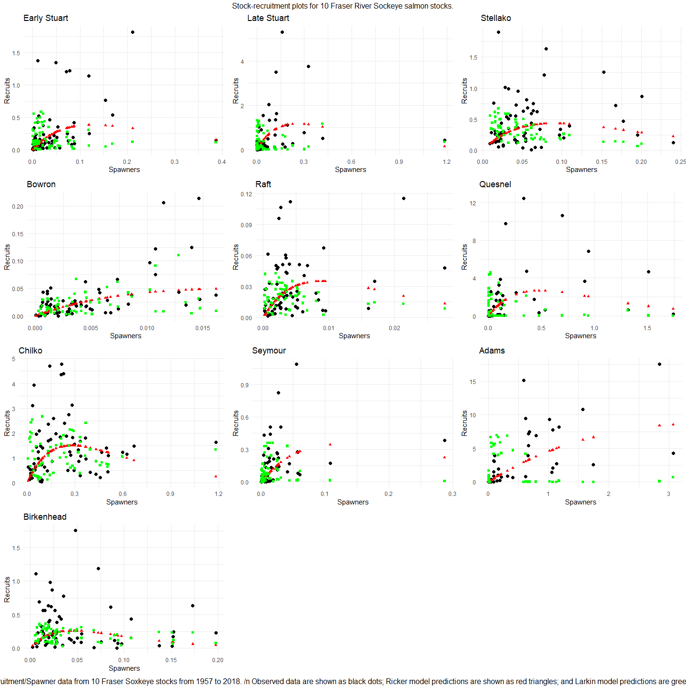

Ricker and Larkin Models - Assignment 4
================
Christian Carson
03/05/2024

Read in the data and set up the procedure section. Data can be read from
github at:
<https://github.com/christiancarson/REM661/blob/main/Assingment%204/Sockeye.data>

``` r
data <- read.table("https://raw.githubusercontent.com/christiancarson/REM661/main/Assingment%204/Sockeye.data", header=TRUE, sep="\t")
stocks    <- unique( data$Stock )
nstock    <- length( stocks )
```

Load required libraries and install if necessary.

``` r
# Load required libraries
library(ggplot2)
```

    ## Warning: package 'ggplot2' was built under R version 4.3.2

``` r
library(gridExtra)
```

    ## Warning: package 'gridExtra' was built under R version 4.3.2

``` r
library(dplyr)
```

    ## Warning: package 'dplyr' was built under R version 4.3.2

    ## 
    ## Attaching package: 'dplyr'

    ## The following object is masked from 'package:gridExtra':
    ## 
    ##     combine

    ## The following objects are masked from 'package:stats':
    ## 
    ##     filter, lag

    ## The following objects are masked from 'package:base':
    ## 
    ##     intersect, setdiff, setequal, union

\#()=-S_t+\_t

The Ricker model is written as:
$$\ln\left(\frac{R_t}{S_t}\right)=\alpha-\beta S_t+\omega_t$$

where: - $R_t$ is the number of recruits in year $t$ - $S_t$ is the
number of spawners in year $t$ - $\alpha$ is the intercept - $\beta$ is
the slope - $\omega_t$ is the error term

Here we will fit a linear model to estimate alpha and beta in log( R/S )
= alpha - beta \* S

``` r
Ricker <- function() {
  #Here we create a list to iterate over each stock
  rick <- list()
  
  #Now we create a dataframe to store the outputs of that iteration in the list
  results <- data.frame(
    Stock = character(), 
    Alpha = numeric(), 
    Beta = numeric(), 
    stringsAsFactors = FALSE
  )
  
  #Then we create a loop to iterate over each stock
  for (i in 1:nstock) {
    #We match the stock from the list to the stock in the observation data
    stock.id <- data$Stock == stocks[i]
    
    #We then create a variable for the recruits and spawners for that stock
    R <- data$Recruits[stock.id]
    S <- data$Spawners[stock.id]
    
    #Here we create a LM that predicts the logarithm of the ratio of recruits to spawners (log(R / S)) based on the values of spawners (S).
    fit <- lm(log(R / S) ~ S)
    
    #We store the output of each stock in the rick list. The [[i]] notation indicates that we are storing the output at index i in the list. The output is a list containing two elements: fit and r. fit stores the linear regression model object, and r stores the predicted values of recruits (exp(fit$fitted.values) * S).
    rick[[i]] <- list(fit = fit, r = exp(fit$fitted.values) * S)
    #finally, we use rbind to store the 
    results <- rbind(
      results, 
      data.frame(
        Stock = stocks[i], 
        Alpha = coef(fit)[1], 
        Beta = coef(fit)[2]
      )
    )
  }
  
  return(list(models = rick, coefficients = results))
}
```

Next, we will create a function to estimate parameters and fitted values
based on the Larkin model. The Larkin model is written as:
$$\ln\left(\frac{R_t}{S_t}\right)=\alpha-\beta_0S_t-\beta_1S_{t-1}-\beta_2S_{t-2}-\beta_3S_{t-3}+\omega_t$$

where: - $R_t$ is the number of recruits in year $t$ - $S_t$ is the
number of spawners in year $t$ - $\alpha$ is the intercept - $\beta_0$
is the slope for the current year - $\beta_1$ is the slope for the
previous year - $\beta_2$ is the slope for the year before the previous
year - $\beta_3$ is the slope for the year before the year before the
previous year - $\omega_t$ is the error term

``` r
Larkin <- function(){
  # Create a list to fill with outputs from each stock
  lark <- list()
  results <- data.frame(Stock=character(), Alpha=numeric(), Beta0=numeric(), Beta1=numeric(), Beta2=numeric(), Beta3=numeric(), stringsAsFactors=FALSE)
  
  # Loop over stocks
  for(i in 1:nstock){
    stock.id <- data$Stock == stocks[i]
    R <- data$Recruits[stock.id]
    S <- data$Spawners[stock.id]
    nyr <- length(R)

    # Ensure enough data points for model fitting
    if(nyr > 3){
      Rt <- R[4:nyr]
      St <- S[4:nyr]
      Sm1 <- S[3:(nyr-1)]
      Sm2 <- S[2:(nyr-2)]
      Sm3 <- S[1:(nyr-3)]

      dat <- data.frame(Rt=Rt, St=St, Sm1=Sm1, Sm2=Sm2, Sm3=Sm3)
      fit <- glm(log(Rt/St) ~ St + Sm1 + Sm2 + Sm3, data=dat)

      lark[[i]] <- list(fit=fit, r=exp(fit$fitted.values) * St)
      
      coefs <- coef(fit)
      results <- rbind(results, data.frame(Stock=stocks[i], Alpha=coefs[1], Beta0=coefs[2], Beta1=coefs[3], Beta2=coefs[4], Beta3=coefs[5]))
    }
  }
  
  return(list(models=lark, coefficients=results))
}
```

``` r
# Call the Ricker and Larkin functions
rick_results <- Ricker()
lark_results <- Larkin()

plots <- lapply(1:nstock, function(i) {
  stock_names <- stocks[i]
  stock_data <- data[data$Stock == stock_names, ]
  l_stock_data <- data %>%
    filter(Stock == stock_names) %>%
    filter(Year <= max(Year) - 3)  
  
  p <- ggplot(stock_data, aes(x = Spawners, y = Recruits)) +
    geom_point(color = "black", size = 2) +
    geom_point(aes(y = rick_results$models[[i]]$r), color = "red", shape = 17) +
    geom_point(data=l_stock_data, aes(y = lark_results$models[[i]]$r), color = "green", shape = 15) + 
    labs(title = stock_names, x = "Spawners", y = "Recruits") +
    theme_minimal()
  
  return(p)
})

# Arrange all plots in a grid sized for a html page
allplots <- gridExtra::grid.arrange(grobs = plots, ncol = 3, bottom="Note: Recruitment/Spawner data from 10 Fraser Soxkeye stocks from 1957 to 2018. /n Observed data are shown as black dots; Ricker model predictions are shown as red triangles; and Larkin model predictions are green squares.", top="Stock-recruitment plots for 10 Fraser River Sockeye salmon stocks.")
```

<!-- -->

``` r
print(allplots)
```

    ## TableGrob (6 x 3) "arrange": 12 grobs
    ##     z     cells    name                grob
    ## 1   1 (2-2,1-1) arrange      gtable[layout]
    ## 2   2 (2-2,2-2) arrange      gtable[layout]
    ## 3   3 (2-2,3-3) arrange      gtable[layout]
    ## 4   4 (3-3,1-1) arrange      gtable[layout]
    ## 5   5 (3-3,2-2) arrange      gtable[layout]
    ## 6   6 (3-3,3-3) arrange      gtable[layout]
    ## 7   7 (4-4,1-1) arrange      gtable[layout]
    ## 8   8 (4-4,2-2) arrange      gtable[layout]
    ## 9   9 (4-4,3-3) arrange      gtable[layout]
    ## 10 10 (5-5,1-1) arrange      gtable[layout]
    ## 11 11 (1-1,1-3) arrange text[GRID.text.384]
    ## 12 12 (6-6,1-3) arrange text[GRID.text.385]
