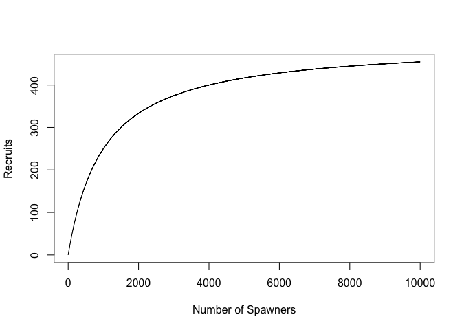
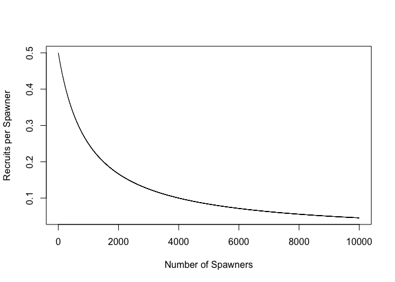
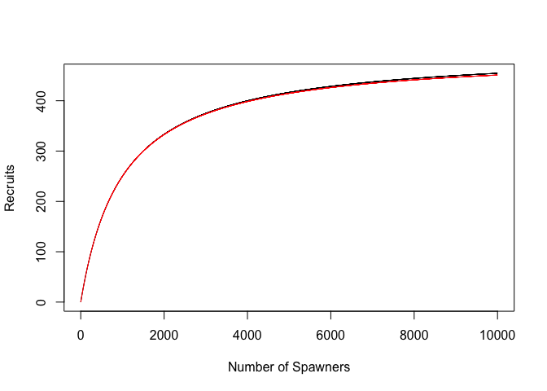

Carrying Capacity
================
Christian Carson
02/08/2024

The following document provides an overview of numerical models,
specifically those for carrying capacity. We start with the exponential
function: where $N_t$ is the number of individuals at time $t$ and $r$
is the growth rate.

\#setup equations as an example The rate of change of a cohort should be
given by:

where $M_t$ is the mortality rate and $N_t$ is the number of individuals
in the cohort at time $t$.

\#recuitment - number of individuals that live to an arbitrary age
\#e.g. sockeye salmon - 4 years or maturing adults

``` r
#a represents maximum survival rate
a <- 0.5
#b represents where carrying capacity is
b <- 0.001
#s represents the number of individuals
s <- 0:10000
#R represents the recruitment
r <- a*s/(1+b*s)
#plot the recruitment
plot(s, a*s/(1+b*s), type = "l", xlab = "Number of Spawners", ylab = "Recruits")
```

<!-- -->

What does this look like percapita?

``` r
#plot the per capita recruitment
plot(s, a/(1+b*s), type = "l", xlab = "Number of Spawners", ylab = "Recruits per Spawner")
```

<!-- -->

What happens when we set M_t = M_0 + M_1\*N_t? \#equation for the above
Total mortalirt can be broken into density dependent and density
independent components:\$M_t = M_0 + M_1 If we plug this all ain we get:

\#equations not showing up in the document

``` r
#number of time steps
n <- 300
#length of time steps
dt <- 1
#M0 represents the density independent mortality
Mo <- -log(a)/n
#Monet represents the density dependent mortality
Mone <- b/(1-a)*Mo
#Rhat represents the predicted number of spawners, integrating 300 time steps to get the number of recruits
Rhat <- matrix(nrow = n, ncol = length(s))
Rhat[1,] <- s
for(t in 2:n){
    #calculate rate of change
    dNdt <- -Mo*Rhat[t-1,] - Mone*Rhat[t-1,]^2
    #calculate the number of recruits in each time step
    Rhat[t,] <- Rhat[t-1,] + dNdt*dt
}
#plot the number of recruits
plot(r~s, type = "l", xlab = "Number of Spawners", ylab = "Recruits")
lines(Rhat[n,]~s, col = "red")
```

<!-- -->
