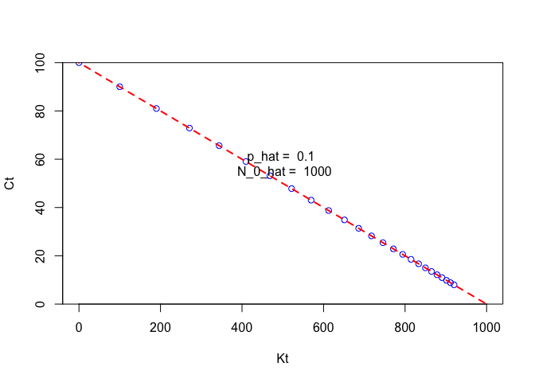

Class 6 Nonlinear Estimation
================
Christian Carson
02/012/2024

State-dynamics model

$C_t = p N_0 - p K_t$

``` r
#N_0 is the initial population or intercept
N_0 = 1000
#p is the proportion of the population that is captured or the slope
p = 0.1
#N_t is the population at time t
N_t <- vector()
#N_0 is the initial population
N_t[1] <- N_0
#C_t is the number of indviduals captured at time t
C_t <- vector()
K_t <- vector()
K_t[1] <- 0

for(t in 1:25) {
 C_t[t] <- p * N_t[t]
 K_t[t+1] <- K_t[t] + C_t[t]
    N_t[t+1] <- N_t[t]- C_t[t]
}

plot(C_t~K_t[1:25], ylim =c(0,N_0*p), xlim = c(0, N_0), yaxs = "i", type = "p", col = "blue", xlab = "Kt", ylab = "Ct")
lin_est <- lm(C_t~K_t[1:25])
abline(coef(lin_est), col = "red", lwd = 2, lty = 2)

#Ct = q No - q Kt
#slope of the line is -q
#intercept of the line is q No
#N0 = intercept/-slope or intercept/q
p_hat <- -lin_est$coef[2]

N_0_hat <- lin_est$coef[1]/p_hat
#add p_hat and N_0_hat to the plot at middle right
text(0.5*N_0, 0.5*N_0*p, labels = paste("p_hat = ", round(p_hat, 2), "\n", "N_0_hat = ", round(N_0_hat, 2)), pos = 3)
```

<!-- -->

``` r
"ThreePass" <- function(N_0 = 100, p=0.5) {
    C_t <- vector()
    N_t <- vector()
    K_t <- vector()
    K_t[1] <- 0
    N_t[1] <- N_0
    for(t in 1:3){
        C_t[t] <- rbinom(n=1, size = N_t[t],prob = p)
        K_t[t+1] <- K_t[t] + C_t[t]
        N_t[t+1] <- N_t[t] - C_t[t]
    }
    lin_est <- lm(C_t~K_t[1:3])
    N_0_hat <- lin_est$coef[1]/-lin_est$coef[2]

        return(N_0_hat)
}
```

This function generated catch values for a 3-pass removal model and
estimates the initial population size. The function can be used to
simulate data and estimate the initial population size.

Now I want to run this repeatededly to evaluate bias and precision of
the estimator.

``` r
N_0 <- 100
p <- 0.4 #proportion of animals caught (instead of proportion of animals caught as effor)
n_rep <- 100
N_0_vec <- vector()

for(i in 1:n_rep) {
    N_0_vec[i] <- ThreePass(N_0 = N_0, p = p)
}

#plot histogram of N_0_vec
hist(N_0_vec, main = "Histogram of N_0_vec", xlab = "N_0_hat", col = "black", freq = FALSE, breaks = 20)
```

<!-- -->

## Schaeffer Production Model - Observation Model

The Schaeffer model is a nonlinear model that is used to estimate the
intrinsic growth rate of a population. The model is given by the
following equation: $$
B_[t+1] = B_t + r B_t (1 - \frac{B_t}{K})
$$ where:

- $B_t$ is the biomass at time t

- r is the intrinsic growth rate

- K is the carrying capacity

Let’s removes some animals from this population:

$$
B_[t+1] = B_t + r B_t (1 - \frac{B_t}{K})- H_t
$$

``` r
"SimSchaefer" <- function(Ht){
    nT <- length(Ht)
    #instrinsic growth rate
    r <- 0.4
    K <- 1000000
    q <- 0.0001
    #population at time 0
    B0 <- K
    #random process error
    v <- rnorm(n = nT, mean = 0, sd = 0.3)
    #observation error
    w <- rnorm(n = nT, mean = 0, sd = 0.1)
    #Biomass at every time step
    Bt <- vector()
    #Abundance at every time step
    It <- vector()
    #initial biomass
    Bt[1] <- B0
    for(t in 1:40) {
        #wt and vt are random errors that account for process and observation error
        #I_t is a total index of abundance, proportional to total abundance
        It[t] <- Bt[t] * q * exp(w[t])
        #the rate at which the population grows will vary log normally: r * Bt[t] * (1 - Bt[t]/K)
        Bt[t+1] <- Bt[t] + r * Bt[t] * (1 - Bt[t]/K) * exp(v[t]) - Ht[t]
    }
out <- list()
out$It <- It
out$Bt <- Bt
return(out)
}#SimSchaefer

Ht <- c(seq(from=150000,to=15000, length=20), seq(from=15000, to=150000, length=20))
sim <- SimSchaefer(Ht = Ht)

It_hat <- sim$It
Bt_hat <- sim$Bt
plot(1:40, Ht, type = "h", lwd = 5, ylab = "Harvest or Biomass", ylim = c(0,1000000) ,xlab = "Year", col = "red")
lines(1:40, Bt_hat[1:40], type = "l", lwd = 2, col = "black")
```

<!-- -->

Process model that replicates the biomass time series

``` r
#How many animals/biomass are out there?
    "process" <- function(pars,Ht){
        r <- exp(pars[1])
        K <- exp(pars[2])
        nT <- length(Ht)
        Bt_hat <- vector()
        Bt_hat[1] <- K
#Schaeffer model
        for(t in 1:nT) {
            Bt_hat[t+1] <- Bt_hat[t] + r * Bt_hat[t] * (1 - Bt_hat[t]/K) - Ht[t]
        }
        return(Bt_hat)
    }
        pars <- c(0.4, 100000)
        process <- process(pars, Ht)
```
